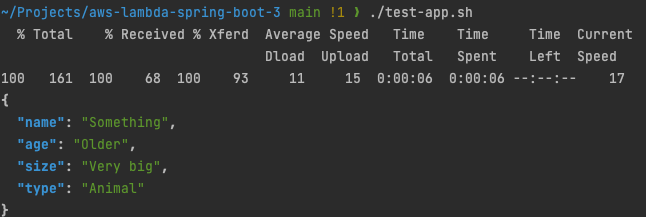
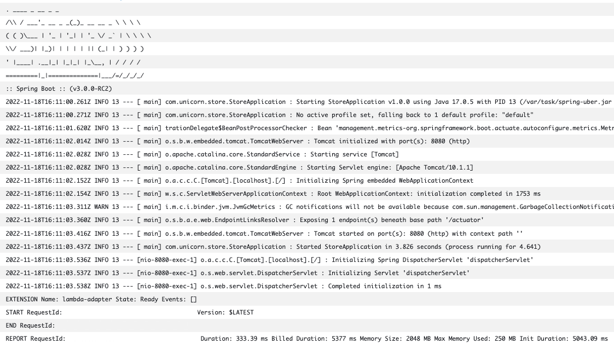

# Spring Boot 3 on AWS Lambda example

The following repository contains an example of a Spring Boot 3 application that is running on AWS Lambda.
Since Spring Boot 3 is based on Java 17, we have to use a [AWS Lambda custom runtime](https://aws.amazon.com/blogs/compute/build-a-custom-java-runtime-for-aws-lambda/). For translation between
API Gateway Events and plain HTTP requests the project uses the [AWS Lambda Web adapter](https://github.com/awslabs/aws-lambda-web-adapter).

## Prerequisites

- Docker
- Maven
- Java 17
- [AWS CDK CLI](https://docs.aws.amazon.com/cdk/v2/guide/cli.html)

## How to build, deploy & test the application

Ensure you are using Java 17 and build the application:

```
mvn clean package -f unicorn-store-spring/pom.xml
```

Run the following script to create a minimal Java 17 JRE via jlink and package it with starting instructions.
```
./build-lambda-custom-jre17.sh
```
If you haven't used AWS CDK on your AWS account before run:

```
cdk bootstrap
```

Deploy the application via AWS CDK use:

```
./deploy.sh
```

After successful deployment you can use the following script to test the application:


```
./test-app.sh
```

## Result





